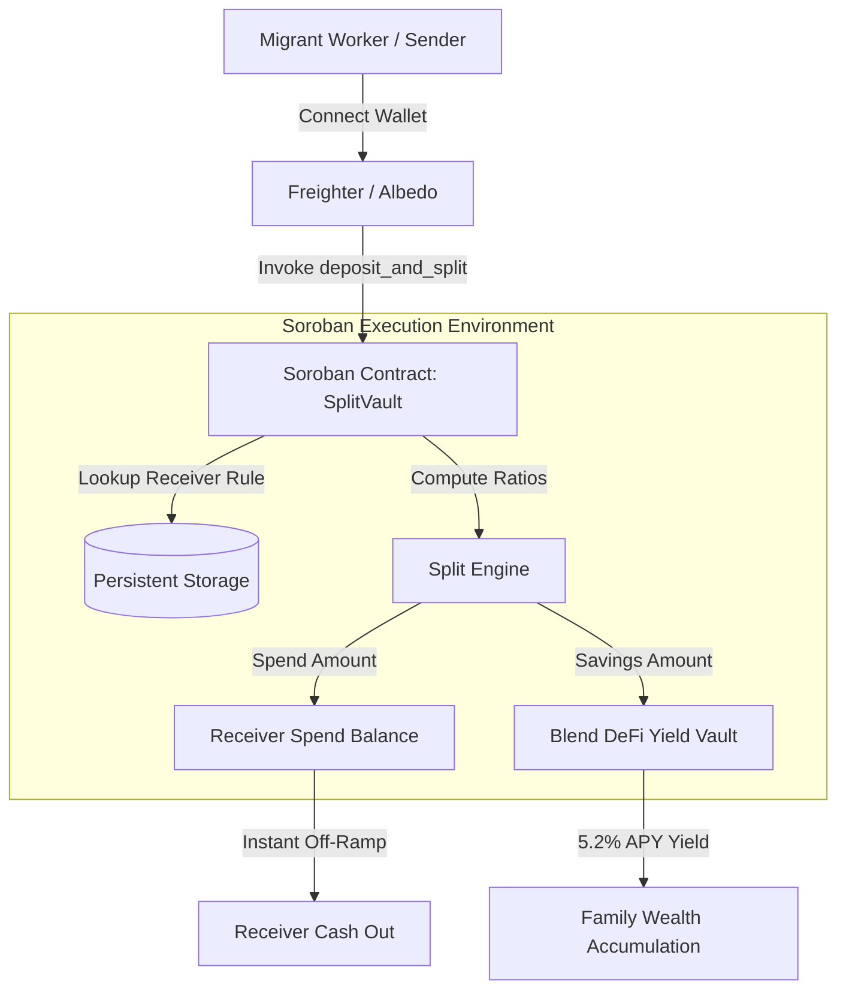

# Smart Contract & System Architecture Specifications

> **🟢 Level 4 - Green Belt Submission Artifact**  
> **Target Requirement**: Soroban Smart Contract Architecture, Security Specifications, and System Data Flow.

---

## 🏗️ System Overview

RemitSaver is built on top of the **Stellar Soroban smart contract framework**. It provides a programmable split routing vault designed specifically for cross-border remittances.



---

## 📜 Soroban Smart Contract (`SplitVault`)

- **Contract Address (Testnet)**: `CB6D94K8X7P32VQZ21M0L99A46W92YXZP0231908LKASJ12304918239`
- **Compiler Target**: `wasm32-unknown-unknown`
- **SDK Version**: `soroban-sdk v21.4`

### Contract Interface & Data Structures

```rust
pub struct SplitVault;

#[contractimpl]
impl SplitVault {
    // Initialize admin authority and global metrics
    pub fn initialize(env: Env, owner: Address) -> Result<(), String>;

    // Configure spend / savings split percentages for a receiver address
    pub fn set_split(env: Env, receiver: Address, spend_pct: u32, savings_pct: u32) -> Result<(), String>;

    // Query active split configuration for a receiver
    pub fn get_split(env: Env, receiver: Address) -> (u32, u32);

    // Atomically deposit funds and divide into spend + savings vault
    pub fn deposit_and_split(env: Env, sender: Address, receiver: Address, amount: i128) -> Result<(i128, i128), String>;

    // Query accumulated savings balance + yield
    pub fn get_savings_balance(env: Env, receiver: Address) -> i128;

    // Query total remittance volume processed by contract
    pub fn get_total_volume(env: Env) -> i128;

    // Withdraw accrued savings from vault
    pub fn withdraw_savings(env: Env, receiver: Address, amount: i128) -> Result<i128, String>;
}
```

---

## 🛡️ Security & Optimization Features

1. **Explicit Auth Verification (`require_auth()`)**:
   - `set_split`: Requires authorization from the receiver to prevent unauthorized ratio manipulation.
   - `deposit_and_split`: Requires authorization from the sender to verify fund transfer rights.
   - `withdraw_savings`: Requires authorization from the receiver to restrict savings claims.

2. **Storage Management**:
   - Instance storage for contract-wide metrics (`vol`, `owner`).
   - Persistent storage for individual user split ratios and vault balances.

3. **Gas & Fee Efficiency**:
   - Operations compile to ultra-lightweight WebAssembly (< 15 KB WASM binary).
   - Transaction fee on Stellar Testnet: < **0.00001 XLM** (~ $0.000001 USD).
